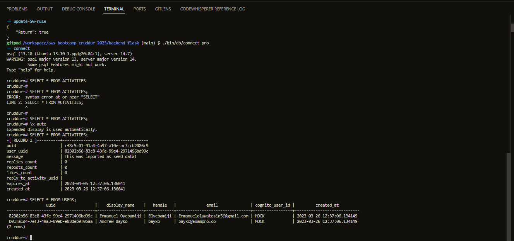

# Week 4 — Postgres and RDS

# Provision RDS via the aws CLI

```
aws rds create-db-instance \
  --db-instance-identifier cruddur-db-instance \
  --db-instance-class db.t3.micro \
  --engine postgres \
  --engine-version  14.6 \
  --master-username root \
  --master-user-password "**********" \
  --allocated-storage 20 \
  --availability-zone us-east-1a" \
  --backup-retention-period 0 \
  --port 5432 \
  --no-multi-az \
  --db-name cruddur \
  --storage-type gp2 \
  --publicly-accessible \
  --storage-encrypted \
  --enable-performance-insights \
  --performance-insights-retention-period 7 \
  --no-deletion-protection
```
We temporarily stoped the RDS instance for 7 days since we aren't using it.

Spin up docker-compose and confgiured Postgres locally

Connected to postgres cli and logged into the postgres cli
```
psql -Upostgres --host localhost
```

created a databse in postgres
```
CREATE database cruddur
```

Created a schema.sql file in the bin directory of our backend folder
```
CREATE EXTENSION IF NOT EXISTS "uuid-ossp";
```

ran the schema.sql file with psql client
```
psql cruddur < db/schema.sql -h localhost -U postgres
```





