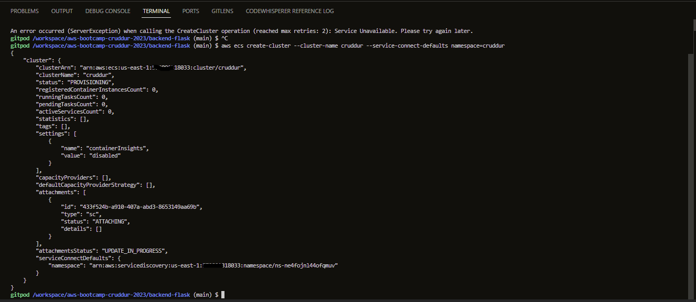

# Week 6 — Deploying Containers

Welcome to Week 6, where we will be covering the following:

- Create an Elastic Container Repository (ECR) 
- Push our container images to ECR
- Write an ECS Task Definition file for Fargate
- Launch our Fargate services via CLI
- Test that our services individually work
- Play around with Fargate desired capacity
- How to push new updates to your code update Fargate running tasks
- Test that we have a Cross-origin Resource Sharing (CORS) issue

Continuing from Week 5 (Dynamodb Implementation), the First step is to create a test script that will check the connection status of our container to the Production or development Url for PostgresSql.

Test RDS Connection
  + Add this test script into db to easily check our connection from our container.
    
  Created a new file ```test``` and included the below code to check our connection status in the ```/backend-flask/bin/db``` directory. (We grant executable permission using ``` chmod u+x ./bin/db/test ```)

  ```python
  #!/usr/bin/env python3
  
  import psycopg
  import os
  import sys
  
  connection_url = os.getenv("CONNECTION_URL")
  
  conn = None
  try:
    print('attempting connection')
    conn = psycopg.connect(connection_url)
    print("Connection successful!")
  except psycopg.Error as e:
    print("Unable to connect to the database:", e)
  finally:
    conn.close()
  ```


We Implemented health check into the ```backend-flask/app.py```

We added the following endpoint for our flask app

  ```python
  @app.route('/api/health-check')
def health_check():
  return {'success': True}, 200
  ```


# Create CloudWatch Log Group
Created a cruddur fargate cluster and set a 1day retention for our logs. However,
```sh
aws logs create-log-group --log-group-name "/cruddur/fargate-cluster"
aws logs put-retention-policy --log-group-name "/cruddur/fargate-cluster" --retention-in-days 1
aws logs delete-retention-policy --log-group-name cruddur
```


The below image shows the successful creation of the Cloudwatch log required for our ECS Fargate cluster


Create ECS Cluster
Created an ECS cluster 

```sh
aws ecs create-cluster \
--cluster-name cruddur \
--service-connect-defaults namespace=cruddur
```




We confirm that the ECS service has been created


Created ECR repo for our backend-flask, frontend-react-js and base image, and pushed image
Created an image for our base image application "cuddur-python"

```sh
aws ecr create-repository \
  --repository-name cruddur-python \
  --image-tag-mutability MUTABLE
```


After creating the repo, we need to login to ECR so we can push our image to the created repository
We used the env var we have set for our AWS credentials

```sh
aws ecr get-login-password --region $AWS_DEFAULT_REGION | docker login --username AWS --password-stdin "$AWS_ACCOUNT_ID.dkr.ecr.$AWS_DEFAULT_REGION.amazonaws.com"
```


Before building our image, we set the path for our image as an environmental variable

```sh
export ECR_PYTHON_URL="$AWS_ACCOUNT_ID.dkr.ecr.$AWS_DEFAULT_REGION.amazonaws.com/cruddur-python"
echo $ECR_PYTHON_URL
```


next step, we pull the python alpine image from the dockerhub
```sh
docker pull python:3.10-slim-buster
```
we tag our image and prepare it to be pushed to our ECR repo

```sh
docker tag python:3.10-slim-buster $ECR_PYTHON_URL:3.10-slim-buster
```
we then push our tagged image to ECR
```sh
docker push $ECR_PYTHON_URL:3.10-slim-buster
```


We can confirm that our new image as been pushed to our created ECR repository


We can confirm that our new image is available locally and pushed to the ECR repo


Next, we updated our Flask app to use our new image from our ECR repo

We then ran a docker-compose up select services to test our new image and confirm the health check

```sh
docker-compose up backend-flask db
```


After our container starts running, we can reach the health check feature added to our ```app.py``` by accessing the backend url via ```/api/health-check```


Create an ECR repo and push the image
Created an image for our backend-flask image application "backend-flask"
```sh
aws ecr create-repository \
  --repository-name backend-flask \
  --image-tag-mutability MUTABLE
```


Created an image for our backend-flask image application "frontend-react-js"
```sh
aws ecr create-repository \
  --repository-name frontend-react-js \
  --image-tag-mutability MUTABLE
```


before building our image, we set the path for our image as an env var
```sh
export ECR_BACKEND_FLASK_URL="$AWS_ACCOUNT_ID.dkr.ecr.$AWS_DEFAULT_REGION.amazonaws.com/backend-flask"
echo $ECR_BACKEND_FLASK_URL
```
we then build the image

```sh
cd backend-flask/
docker build -t backend-flask .
```
we tagged the image and get it ready to be pushed to our created ECR repo for backend-flask
```sh
docker tag backend-flask:latest $ECR_BACKEND_FLASK_URL:latest
```
we pushed our image to the "backend-flask" ECR repo

```sh
docker push $ECR_BACKEND_FLASK_URL:latest
```


We can confirm from the AWS GUI that our repositories (cruddur-python and backend-flask) are up and running on the ECR


Now, we Create Task and Exection Roles for Task definition

Before creating the task and definitions, we need to setup parameters in the AWS Systems Manager to handle our secrets and environmental variables as parameters

```sh
aws ssm put-parameter --type "SecureString" --name "/cruddur/backend-flask/AWS_ACCESS_KEY_ID" --value $AWS_ACCESS_KEY_ID
aws ssm put-parameter --type "SecureString" --name "/cruddur/backend-flask/AWS_SECRET_ACCESS_KEY" --value $AWS_SECRET_ACCESS_KEY
aws ssm put-parameter --type "SecureString" --name "/cruddur/backend-flask/CONNECTION_URL" --value $PROD_CONNECTION_URL
aws ssm put-parameter --type "SecureString" --name "/cruddur/backend-flask/ROLLBAR_ACCESS_TOKEN" --value $ROLLBAR_ACCESS_TOKEN
aws ssm put-parameter --type "SecureString" --name "/cruddur/backend-flask/OTEL_EXPORTER_OTLP_HEADERS" --value $OTEL_EXPORTER_OTLP_HEADERS
```


First, we create executionrole

create a json file named service-execution-policy in the aws/policies directory

```json
{
  "Version":"2012-10-17",
  "Statement":[{
    "Action":["sts:AssumeRole"],
    "Effect":"Allow",
    "Principal":{
      "Service":["ecs-tasks.amazonaws.com"]
    }
  }]
}
```
then we run the aws command

```sh
aws iam create-role \
    --role-name CruddurServiceExecutionRole \
    --assume-role-policy-document file://aws/policies/service-assume-execution-policy.json
```


then we create the service-assume-execution-policy in the aws/policies directory

```json
{
  "Version":"2012-10-17",
  "Statement":[{
    "Effect": "Allow",
    "Action": [
      "ssm:GetParameters",
      "ssm:GetParameter"
    ],
    "Resource": "arn:aws:ssm:us-east-1:(account-id):parameter/cruddur/backend-flask/*"
  }]
}
```
then we run the aws command

```sh
aws iam put-role-policy \
    --policy-name CruddurServiceExecutionPolicy \
    --role-name CruddurServiceExecutionRole \
    --policy-document file://aws/policies/service-execution-policy.json
```


we create task role

```sh
aws iam create-role \
    --role-name CruddurTaskRole \
    --assume-role-policy-document "{
  \"Version\":\"2012-10-17\",
  \"Statement\":[{
    \"Action\":[\"sts:AssumeRole\"],
    \"Effect\":\"Allow\",
    \"Principal\":{
      \"Service\":[\"ecs-tasks.amazonaws.com\"]
    }
  }]
}"
```


We grant permission to the task role we created for access for CloudWatch and X-Ray Deamon

```sh
aws iam attach-role-policy --policy-arn arn:aws:iam::aws:policy/CloudWatchFullAccess --role-name CruddurTaskRole
aws iam attach-role-policy --policy-arn arn:aws:iam::aws:policy/AWSXRayDaemonWriteAccess --role-name CruddurTaskRole
```


Now, we progress to create our task-definition ```aws/task-definition``` directory and create a file ```backend-flask.json```

```json
{
  "family": "backend-flask",
  "executionRoleArn": "arn:aws:iam::AWS_ACCOUNT_ID:role/CruddurServiceExecutionRole",
  "taskRoleArn": "arn:aws:iam::AWS_ACCOUNT_ID:role/CruddurTaskRole",
  "networkMode": "awsvpc",
  "containerDefinitions": [
    {
      "name": "backend-flask",
      "image": "BACKEND_FLASK_IMAGE_URL",
      "cpu": 256,
      "memory": 512,
      "essential": true,
      "portMappings": [
        {
          "name": "backend-flask",
          "containerPort": 4567,
          "protocol": "tcp", 
          "appProtocol": "http"
        }
      ],
      "logConfiguration": {
        "logDriver": "awslogs",
        "options": {
            "awslogs-group": "cruddur",
            "awslogs-region": "us-east-1",
            "awslogs-stream-prefix": "backend-flask"
        }
      },
      "environment": [
        {"name": "OTEL_SERVICE_NAME", "value": "backend-flask"},
        {"name": "OTEL_EXPORTER_OTLP_ENDPOINT", "value": "https://api.honeycomb.io"},
        {"name": "AWS_COGNITO_USER_POOL_ID", "value": ""},
        {"name": "AWS_COGNITO_USER_POOL_CLIENT_ID", "value": ""},
        {"name": "FRONTEND_URL", "value": ""},
        {"name": "BACKEND_URL", "value": ""},
        {"name": "AWS_DEFAULT_REGION", "value": ""}
      ],
      "secrets": [
        {"name": "AWS_ACCESS_KEY_ID"    , "valueFrom": "arn:aws:ssm:AWS_REGION:AWS_ACCOUNT_ID:parameter/cruddur/backend-flask/AWS_ACCESS_KEY_ID"},
        {"name": "AWS_SECRET_ACCESS_KEY", "valueFrom": "arn:aws:ssm:AWS_REGION:AWS_ACCOUNT_ID:parameter/cruddur/backend-flask/AWS_SECRET_ACCESS_KEY"},
        {"name": "CONNECTION_URL"       , "valueFrom": "arn:aws:ssm:AWS_REGION:AWS_ACCOUNT_ID:parameter/cruddur/backend-flask/CONNECTION_URL" },
        {"name": "ROLLBAR_ACCESS_TOKEN" , "valueFrom": "arn:aws:ssm:AWS_REGION:AWS_ACCOUNT_ID:parameter/cruddur/backend-flask/ROLLBAR_ACCESS_TOKEN" },
        {"name": "OTEL_EXPORTER_OTLP_HEADERS" , "valueFrom": "arn:aws:ssm:AWS_REGION:AWS_ACCOUNT_ID:parameter/cruddur/backend-flask/OTEL_EXPORTER_OTLP_HEADERS" }
        
      ]
    }
  ]
}
```

after ceating the file, we register the created task definition

```sh
aws ecs register-task-definition --cli-input-json file://aws/task-definitions/backend-flask.json
```

Next step is to add the backend-flask service to the ECS "cruddur" cluster, 
However, we need to get our default VPC_ID to progress 

```sh
export DEFAULT_SUBNET_IDS=$(aws ec2 describe-subnets  \
 --filters Name=vpc-id,Values=$DEFAULT_VPC_ID \
 --query 'Subnets[*].SubnetId' \
 --output json | jq -r 'join(",")')
echo $DEFAULT_SUBNET_IDS
```

Then we progress to create a security group for the ECS cluster

```sh
export CRUD_SERVICE_SG=$(aws ec2 create-security-group \
  --group-name "crud-srv-sg" \
  --description "Security group for Cruddur services on ECS" \
  --vpc-id $DEFAULT_VPC_ID \
  --query "GroupId" --output text)
echo $CRUD_SERVICE_SG
```

After creating the SG, we need to grant ingress permission for access to the cluster

```sh
aws ec2 authorize-security-group-ingress \
  --group-id $CRUD_SERVICE_SG \
  --protocol tcp \
  --port 80 \
  --cidr 0.0.0.0/0
```


After creating the security group, we can use the below script to echo it.

```sh
export CRUD_SERVICE_SG=$(aws ec2 describe-security-groups \
  --filters Name=group-name,Values=crud-srv-sg \
  --query 'SecurityGroups[*].GroupId' \
  --output text)
```
We can confirm our service has been created in our cluster


After successful creation of the ```backend-flask``` service created in our cluster, we checked for the health status of our running tasks.


We also add shell access to the running task using the script we created ```backend-flask/bin/ecs/connect-to-service``` 


We also confirmed access to database connection using the script we created ```/bin/db/test``` within the interactive enviroment of our ```backend-flask``` container


After creating our service the the ECS cluster, we confirmed access to our ```backend-flask/app.py``` via ```/api/notifications```


```json

{
    "cluster": "cruddur",
    "launchType": "FARGATE",
    "desiredCount": 1,
    "enableECSManagedTags": true,
    "enableExecuteCommand": true,
    "networkConfiguration": {
      "awsvpcConfiguration": {
        "assignPublicIp": "ENABLED",
        "securityGroups": [
          "sg-0b44f3ea78f368bdc"
        ],
        "subnets": [
            "subnet-0b16b33182837edc3",
            "subnet-02de565effbff4ca4",
            "subnet-0bc279f0bb085dbaf",
            "subnet-0c15346fbfeb68753",
            "subnet-0322792782d28b241",
            "subnet-0e5dc607822a004a8"
        ]
      }
    },
    "propagateTags": "SERVICE",
    "serviceName": "backend-flask",
    "taskDefinition": "backend-flask",
    "serviceConnectConfiguration": {
      "enabled": true,
      "namespace": "cruddur",
      "services": [
        {
          "portName": "backend-flask",
          "discoveryName": "backend-flask",
          "clientAliases": [{"port": 4567}]
        }
      ]
    }
  }

```

After creating the Json file, we use the below code to provision the services described in the json document in our ECS Cluster

```sh
aws ecs create-service --cli-input-json file://aws/json/service-backend-flask.json
```

We then confirm the health-check of our app via the deployed container


Now, We set up Load Balancer

Application Load Balancer


aws ecs create-service --generate-cli-skeleton


```json
{
    "cluster": "cruddur",
    "launchType": "FARGATE",
    "desiredCount": 1,
    "enableECSManagedTags": true,
    "enableExecuteCommand": true,
    "loadBalancers": [
      {
        "targetGroupArn": "arn:aws:elasticloadbalancing:us-east-1:572891318033:targetgroup/cruddur-backend-flask-tg/677b3b86b4e67989",
        "loadBalancerName": "arn:aws:elasticloadbalancing:us-east-1:572891318033:loadbalancer/app/cruddur-alb/cb40a8cd01ba6367",
        "containerName": "backend-flask",
        "containerPort": 4567
      }
    ],
    "networkConfiguration": {
      "awsvpcConfiguration": {
        "assignPublicIp": "ENABLED",
        "securityGroups": [
          "sg-0b44f3ea78f368bdc"
        ],
        "subnets": [
            "subnet-0b16b33182837edc3",
            "subnet-02de565effbff4ca4",
            "subnet-0bc279f0bb085dbaf",
            "subnet-0c15346fbfeb68753",
            "subnet-0322792782d28b241",
            "subnet-0e5dc607822a004a8"
        ]
      }
    },
    "propagateTags": "SERVICE",
    "serviceName": "backend-flask",
    "taskDefinition": "backend-flask",
    "serviceConnectConfiguration": {
      "enabled": true,
      "namespace": "cruddur",
      "services": [
        {
          "portName": "backend-flask",
          "discoveryName": "backend-flask",
          "clientAliases": [{"port": 4567}]
        }
      ]
    }
  }
```
