# Week 8 — Serverless Image Processing

Welcome to Week 8, where we covered the following:
- Implemented CDK Stack
- Served Avatars via CloudFront
- Implemented Users Profile Page
- Did a DB Migration
- Implemented Uploading of Avatar 

## Preparation
This week, we need to use a CDK (Cloud Development Kit) to create S3 buckets, Lambda functions, SNS topics, etc., which allowed users to upload their avatars (display pictures) to update their profiles.
I implemented some scripts to make our lives easier. The scipt prepares our enviroment and launch our application locally. To be done more efficiently, i created a script as seen in ./bin/init [code](https://github.com/EOyebamiji/aws-bootcamp-cruddur-2023/blob/d141a6ee727a5b35ac175374a459fa967c2579ad/bin/init) for this purpose.

## Implemented CDK Stack
Firstly, we manually created an S3 bucket named ```assets.<domain_name>.com``` (n my own case, ```assets.eoyebamiji.com```) and programmed our CDK implementation stack to automatically create another S3 bucket ```eoyebamiji-uploaded-avatars``` to store processed images, which will be used for serving the processed images in the profile page. In this bucket, we created a folder named banners to store the upload of our prefered banner in a specified file format, in this case jpg/jpeg.

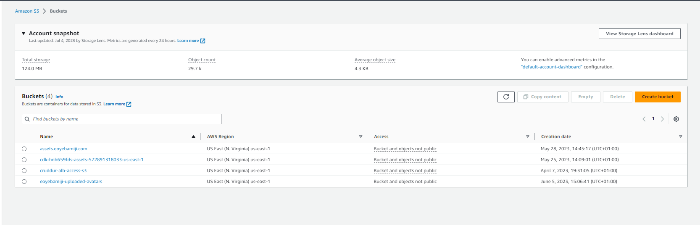

I proceeded to bootstrap the CDK and created the serverless stack with the typescript CDK. Followed the instructions fromm the live class.

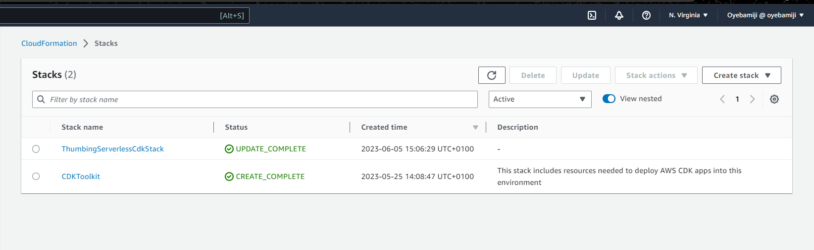
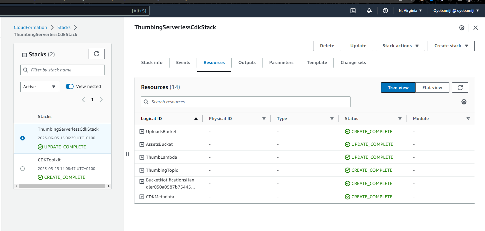

## Served Avatars via CloudFront
I setup CloudFront distribution with my custom domain ```eoyebamiji.com``` to serve assests from my ```"assets.eoyebamiji.com"``` s3 bucket and created a Rout53 record for this distribution. I mapped my certificate issued by ```Route53``` to the created cloudfront distribution following AWS policy of having certificates  created in ```us-east-1```. After creating the cloudfront  distribution, It was a necessity to create an ```Invalidation``` to assist in ensuring latest avatars are used instead of cached up data, since we haven't implemented a lifecycle policy for avatars uploaded to our S3 and a versioning system. This invalidation was created expicitly for contents in the ```/avatars/*``` path. This ensures that CloudFront will always serve the latest avatar uploaded by the user. I also created a WAF for the cloudfront distribution to provide an additional layer of security.

Created Cloudfront Distribution

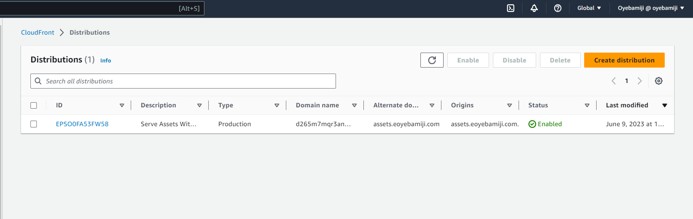

Cloudfront Distribution created with a custom domain and WAF

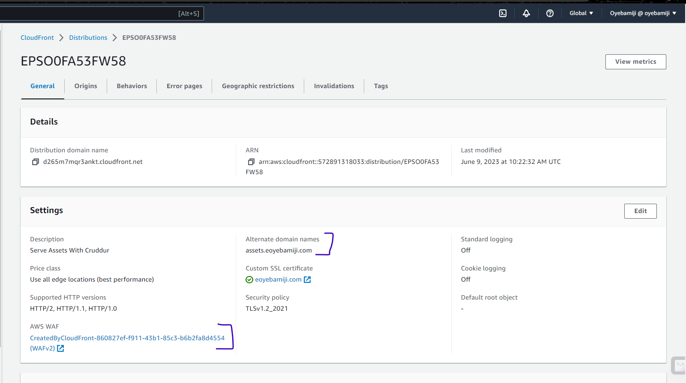

Cloudfront Distribution Route53 Record in our hosted zone

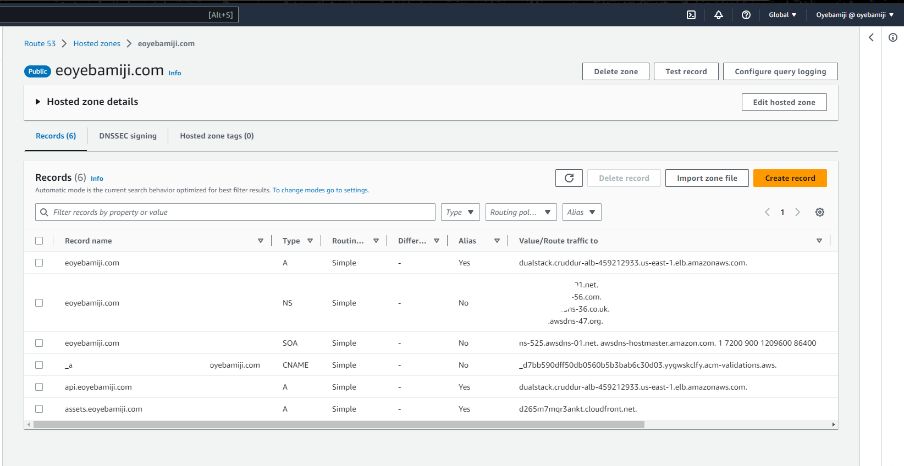

Cloudfront Distribution with S3 bucket as its Origin

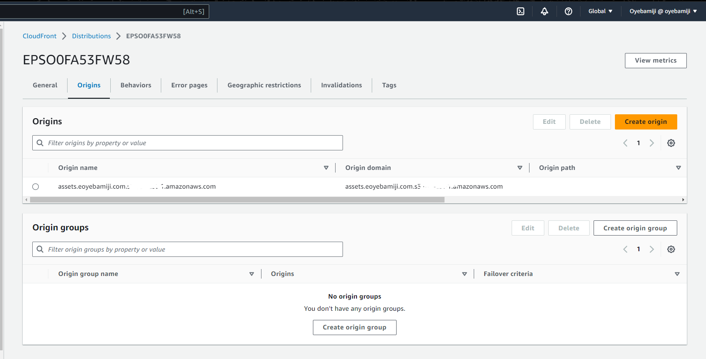

Cloudfront Distribution with created Web Application Firewall

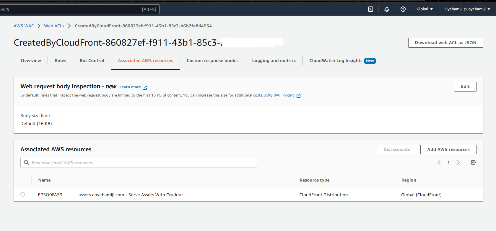

Cloudfront Distribution with created invalidations to always server the latest avatar uploaded to our user profile (Display Picture)

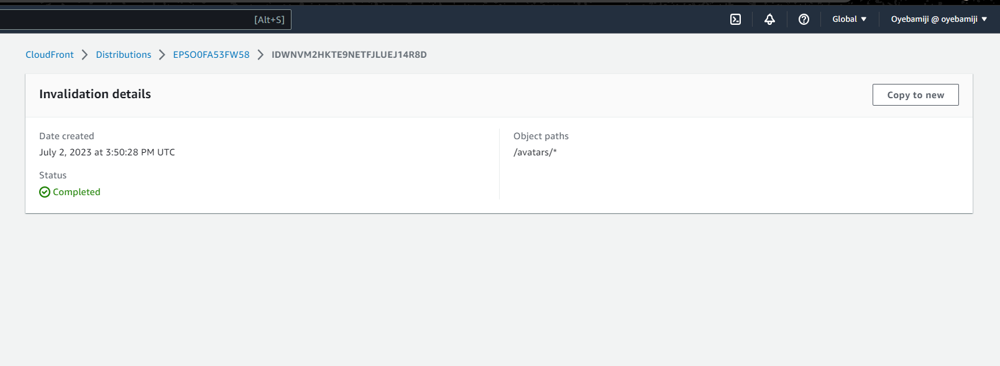


## Implemented Backend and Frontend for user Profile Page

I implemented the user profile page that displays to display the banner, the display picture and status updates by updating the below directories in the code base. And also, to change the display name, bio and avatar.

### Backend

 + ```backend-flask/db/sql/users/show.sql``` to obtain the information about the user account
 + ```backend-flask/db/sql/users/update.sql``` to update the user biodata
 + ```backend-flask/services/user_activities.py```
 + ```backend-flask/services/update_profile.py```
 + ```backend-flask/app.py``` Added backend endponts for some new JS components created.

### Frontend

+ ```frontend-react-js/src/components/ActivityFeed.js```
+ ```frontend-react-js/src/components/CrudButton.js```
+ ```frontend-react-js/src/components/DesktopNavigation.js``` 
+ ```frontend-react-js/src/components/EditProfileButton.css```
+ ```frontend-react-js/src/components/EditProfileButton.js```
+ ```frontend-react-js/src/components/Popup.css```
+ ```frontend-react-js/src/components/ProfileAvatar.css```
+ ```frontend-react-js/src/components/ProfileAvatar.js```
+ ```frontend-react-js/src/components/ProfileForm.css```
+ ```frontend-react-js/src/components/ProfileForm.js```
+ ```frontend-react-js/src/components/ProfileHeading.css```
+ ```frontend-react-js/src/components/ProfileHeading.js```
+ ```frontend-react-js/src/components/ProfileInfo.js```
+ ```frontend-react-js/src/components/ReplyForm.css```
+ ```frontend-react-js/src/pages/HomeFeedPage.js```
+ ```frontend-react-js/src/pages/NotificationsFeedPage.js```
+ ```frontend-react-js/src/pages/UserFeedPage.js```
+ ```frontend-react-js/src/lib/CheckAuth.js```
+ ```frontend-react-js/src/App.js```
+ ```frontend-react-js/jsconfig.json```

Implemented user profile with status, banner, avatar (display picture) and bio update (Status Update)
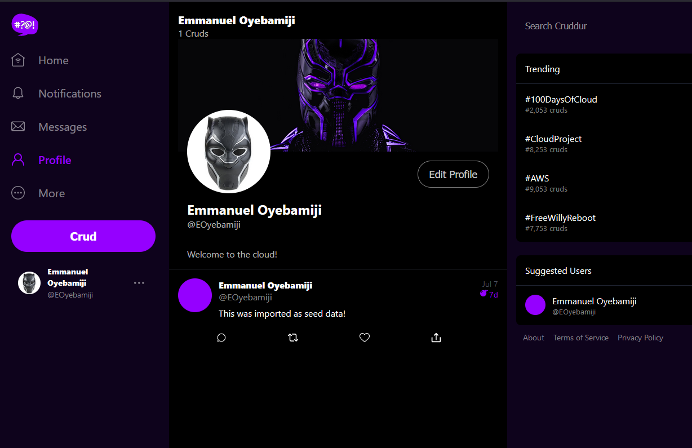

Implemented User profie form
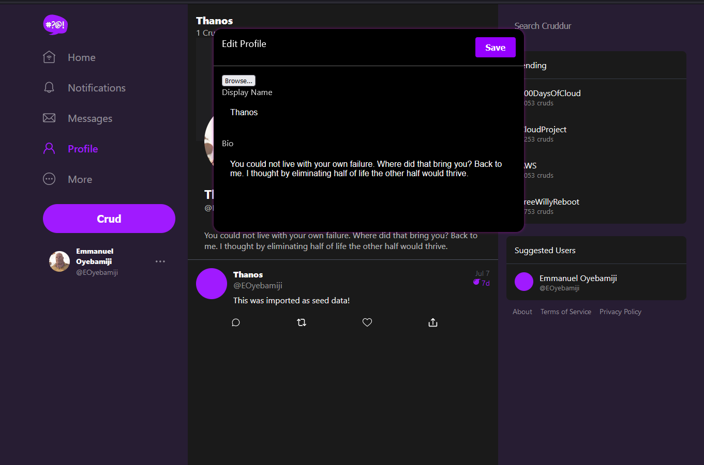

Implemented User profie test
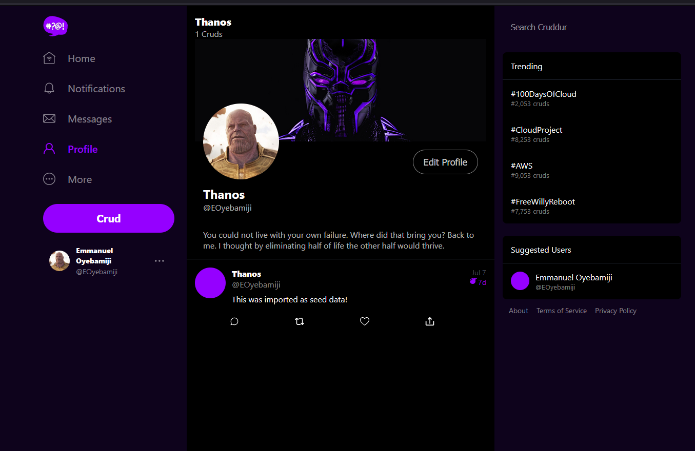

## Database Migration
Since our previous postgres database didn't have the column for saving bio, migration is required. We also need to update some backend scripts in order to let users edit bio and save the updated bio in the database.
I've impleneted the backend [Database Migration](https://github.com/EOyebamiji/aws-bootcamp-cruddur-2023/blob/7f12cd163a91b1077b5165fdfa9b5cb521258376/bin/db/migrate) and [Rollbacks](https://github.com/EOyebamiji/aws-bootcamp-cruddur-2023/blob/7f12cd163a91b1077b5165fdfa9b5cb521258376/bin/db/rollback). 
Updated the ```backend-flask/db/schema.sql```, and ```backend-flask/lib/db.py``` with verbose option.


Migration and Rollback
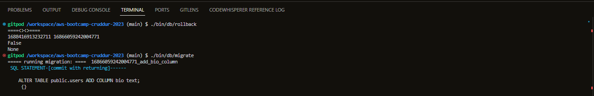

## Implemented Uploading of Avatar
We need to create an API endpoint, which invokes a presigned URL. This presigned URL grants access to the created S3 bucket ```eoyebamiji-uploaded-avatars```, and deliver the uploaded image to the bucket.

We will call presigned URl to path ```/avatars/key_upload``` to do the upload, where the /avatars/key_upload resource is handled by the POST method configured in the API gateway. I created a Lambda function named ```CruddurAvatarUpload``` to decode the URL and the request. In addition, we need to implement authorization with another Lambda function named ```CruddurApiGatewayLambdaAuthorizer```, which is invoked by the ```CruddurJWTAuthorizer``` created in the API gateway. *it is important to control the data that is allowed to be transmitted from our gitpod workspace using the APIs. Note that manually configuring/setting cors in API gateway overwrites the cors configuration in our Lambda code.


Before the successful implementation of the API gateway, i created the Lambda functions required for the HTTP API gateway:

+ I created a directory ```crudduer-upload-avatar``` in the aws directory with the path ```aws/lambdas/cruddur-upload-avatar/```, created a ```function.rb``` file in the directory and run bundle init; edit the generated Gemfile and add other dependencies needed for our function to work, such as ```ox``` and ```jwt```, then run ```bundle install``` to install the function dependencies and ```bundle exec ruby function.rb``` to run the function.rb; a presigned url is generated for local testing with the use of postman to send post messages to our S3 bucket. The final modified ```function.rb``` is used in ```CruddurAvatarUpload```which is invovked by the API gatewayurl path to the ```avatar/upload``` created. (After configuring the Lambda, please to renamed the runtime management handler to ```function.handler``` as i spent hours debugging this error i made)

+ I created another directory ```lamda-authorizer``` in aws/lambdas/lambda-authorizer/, created an ```index.js```, and ran ```npm install aws-jwt-verify --save``` this installs ```AWS JWT``` packages and saves into the ```node_modules```, I downloaded everything in this folder locally and then zipped the downloaded files to one zip file file (I spent weeks troubleshooting this only to realise i had a double director e.g. /lambdas/lambda-authorizer/lambda-authorizer as opposed to /lambda-authorizer alone.), which will be uploaded into CruddurApiGatewayLambdaAuthorizer.

Lambda Function CruddurAvatarUpload
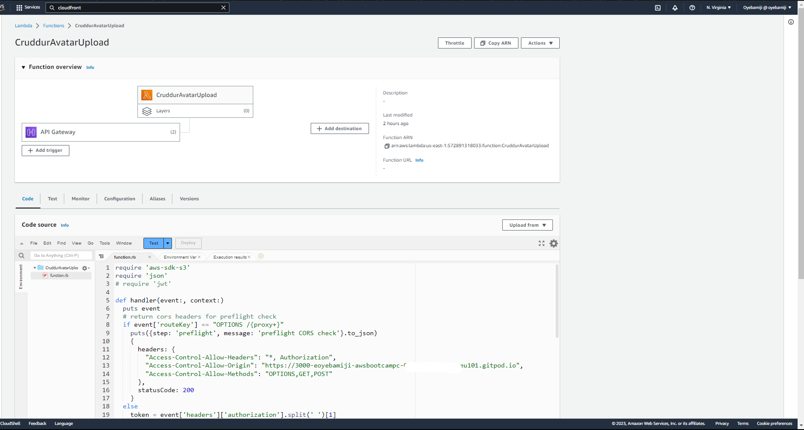

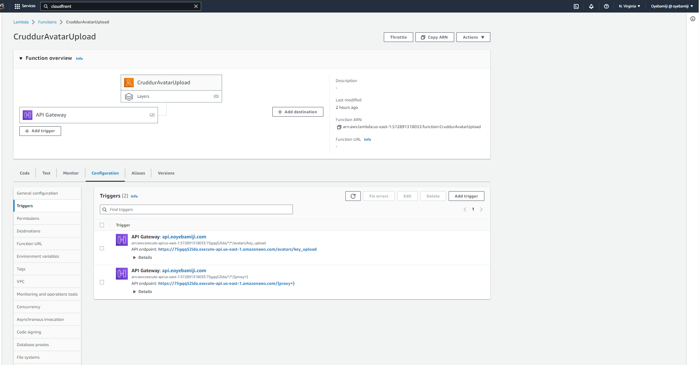

Lambda Function CruddurAvatarUpload
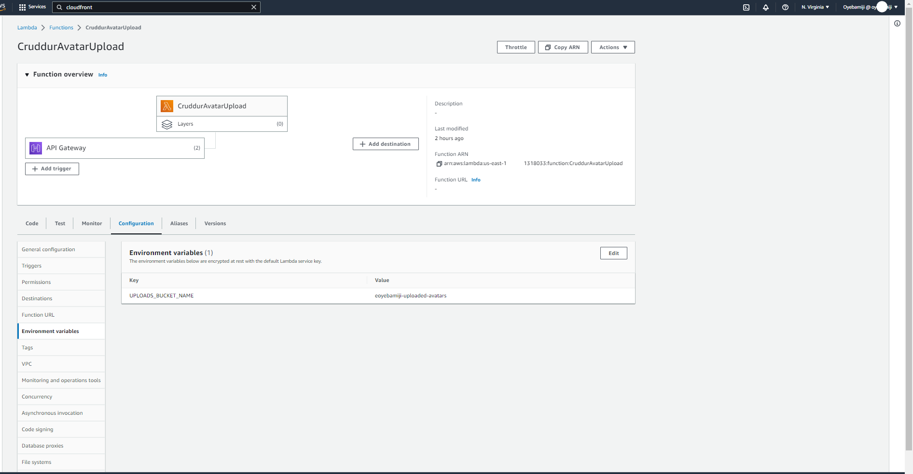

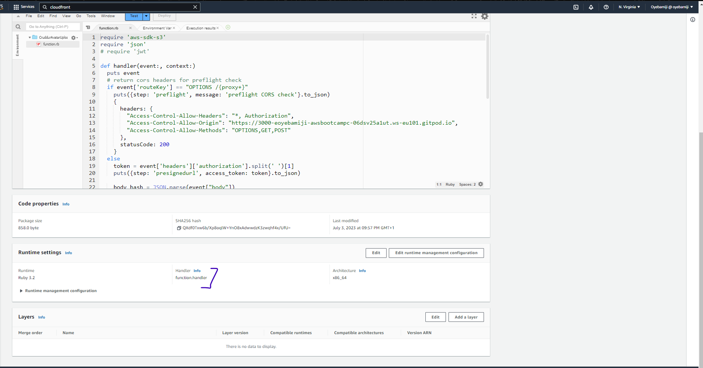

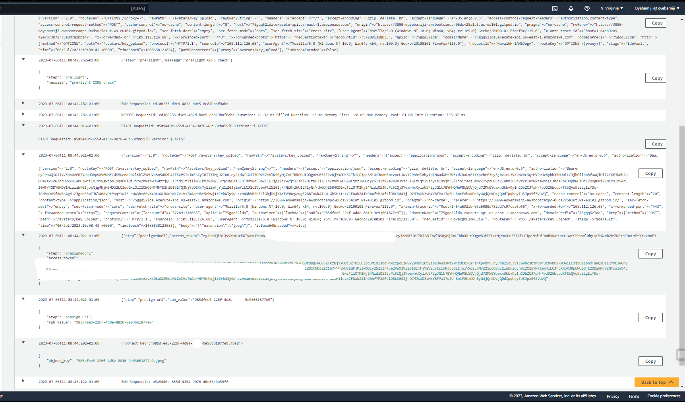

Lambda Function CruddurAPILambdaAuthorizer

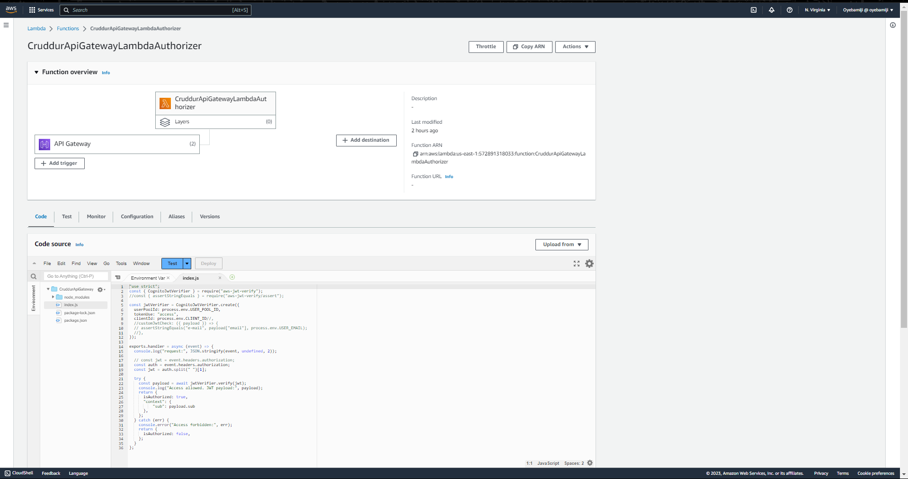

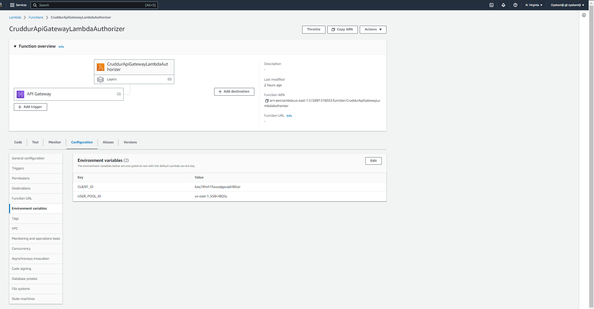

After creating the Lambda Functions, I created the API Gateway, create api.<domain_name> ```api.eoyebamiji.com```, created two routes:

+ ```POST /avatars/key_upload``` with the created authorizer ```CruddurJWTAuthorizer``` which invokes the ```CruddurApiGatewayLambdaAuthorizer``` Lambda function, and with integration ```CruddurAvatarUpload```
+ ```OPTIONS /{proxy+}``` without authorizer, but integration with the created CruddurAvatarUpload Lambda function

Noted that I don't need to configure CORS at API Gateway. If you did before, click "Clear" to avoid potential CORS issues.Note that manually configuring/setting cors in API gateway overwrites the cors configuration in our Lambda code.

API Gateway

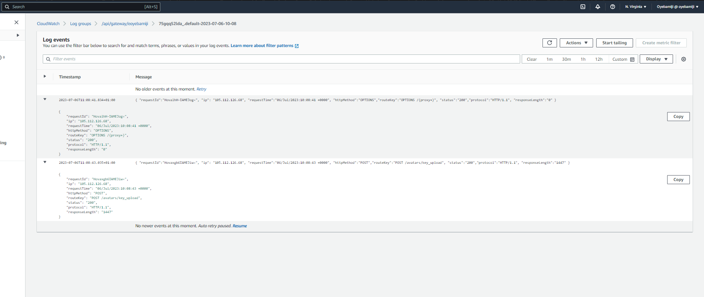

Created a custom domain with ```api.eoyebamiji.com```


Configured routes for API Gateway ```POST``` for ```/avatars/key_upload``` and ```OPTIONS``` for ```{proxy+}```

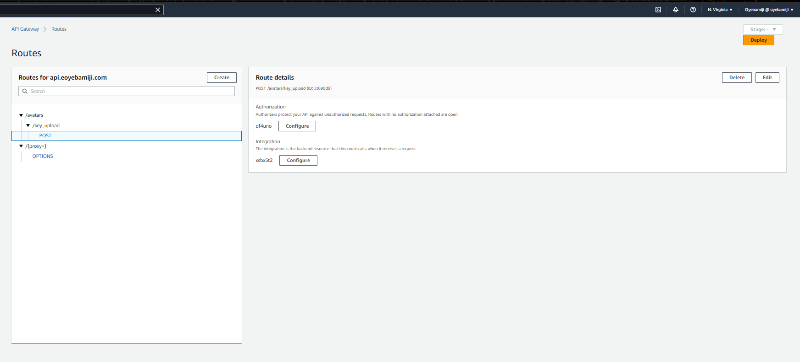

Integrated routes to the created authorizer which invokes the ```CruddurApiGatewayLambdaAuthorizer``` Function

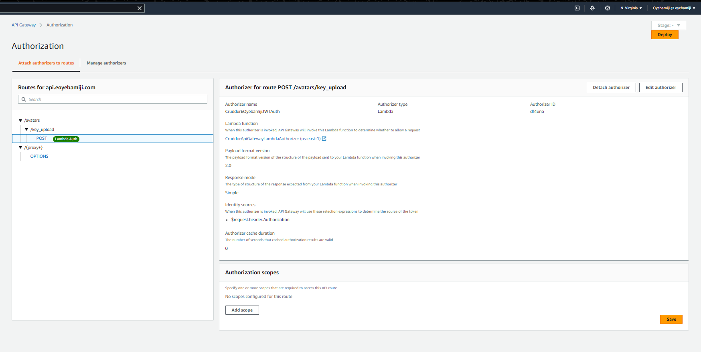

Integrated routes to the created CruddurUploadAvatar Function

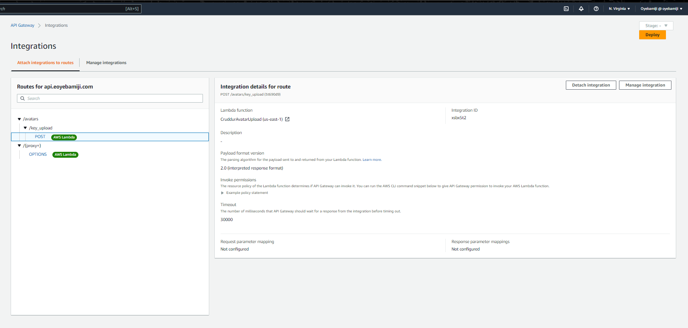

Created Logging for API gateway to aid troubleshooting

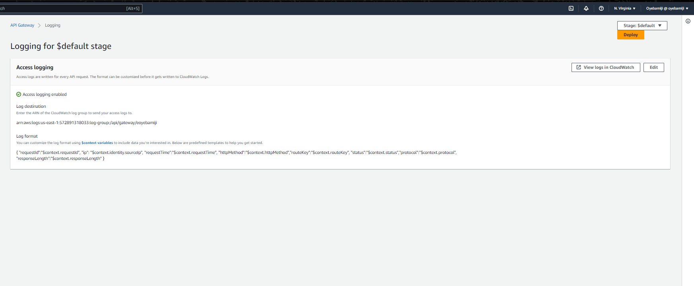

Captured Logs in CloudWatch for API Gateway ```POST``` and ```OPTIONS```

