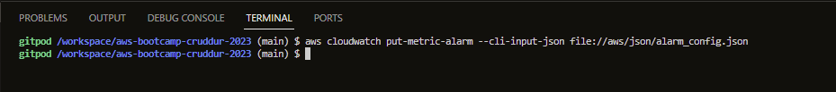
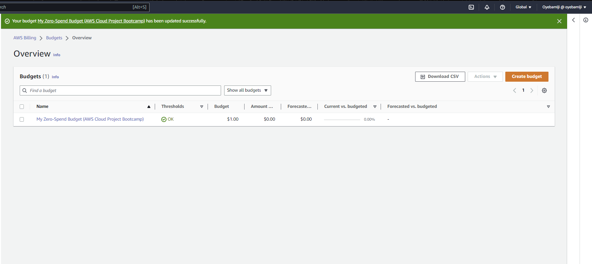

# Week 0 — Billing and Architecture
## Journal Entry - Week 0: AWS Billings and Architectural Designs

In Week 0, a range of important topics relating to AWS Billings and Architectural Designs (Sketchs/Conceptual (Napkin) Designs, and Proper Schematics) were covered during the live stream session. The live class covered the importance of having a great understanding of the business case of our applications and how best to prepare a pitch deck to Technical (CTO, COO) and Non-Technical Stakeholders (CFO), Project Members, Users and Testers and approach the conceptual design with less technical details and easy to understand. Live demo of "Napkin" designs and Logical Architectural designs were following through using Lucid Chart.

One of the key areas focused on was managing access to AWS resources using AWS Identity and Access Management (IAM). I learned about the different IAM policies that can be used to grant or restrict access to different AWS services and resources. It was emphasized that proper IAM management is crucial for maintaining the security and integrity of my AWS resources as covered in the Cloud Security session held by Ashiah Rajan, where he also mentioned the importance of having accounts grouped/structured in an AWS Organization and use of proper logging and monitoring using AWS Cloud Trail.

I learned about the AWS Organizations, which is a service that enables me to manage multiple AWS accounts from a single AWS account. This is especially useful for organizations with complex cloud architectures or large teams, as it allows us to centralize our billing and set up policies to enforce security and compliance standards across all accounts. It also helps organizations create accounts readily available for use and be activated on demand.

Another important service I learned is the AWS Billings, which is an important feature of AWS for setting up and managing budgets. I learned how to create and customize budgets using the GUI and CLI via JSON codes, to track my AWS costs, set alerts when certain thresholds are reached, and prevent unexpected spikes in my bills. This is particularly important as I work on this (bootcamp) project development as I am looking to keep my bills as minimal as possible, it also allows me to monitor my AWS usage and make adjustments where necessary to stay within my budget.

Finally, I learned about the use of AWS CloudWatch Alarms to monitor key performance metrics for my AWS resources and receive notifications when certain thresholds are met. This is an important part of my security considerations, as it helps me detect and respond to potential security threats or other issues that could impact my progress throughout this bootcamp and the project development.

Overall, Week-0 was a great introduction to the key AWS services and tools that we will be using throughout the bootcamp. I'm looking forward to continuing to learn and explore how we can best leverage these services to build secure and scalable cloud architectures for our project.

The Solution to the Assignemnt of week 0 is as follows:

# Required Homework

## Recreate Conceptual Diagram in Lucid Charts


You can view here >>> [Conceptual Diagram in Lucid Charts](https://lucid.app/lucidchart/455fe163-12c5-4d1a-aa2f-50814ada8bbc/edit?viewport_loc=-1156%2C-710%2C3288%2C1674%2C0_0&invitationId=inv_bbc21a1a-a061-43ac-a224-a9b128c733dd)

## Recreate Logical Architectual Diagram in Lucid Charts


You can view here >>> [Logical Diagram in Lucid Charts](https://lucid.app/lucidchart/8f2f06b6-1e26-4b83-ae98-ef7d4fcd81f6/edit?view_items=8zPxB~y6JEtN&invitationId=inv_df154176-32fb-453c-a1b1-7b7341f868e4)

## Create a Billing Alarm
In order to create a billing alarm, a few requirements needs to be checked, such as creating a SNS Topic with a designated billing name. SNS Topic was created using the below code via the cli.
```
aws sns create-topic --name billing-alarm
```


On creation of the SNS Topic, a TopicARN is generated which is required to create the next requirement for this task which is the subscription. This was created using the below code via the cli.
```
aws sns subscribe \
    --topic-arn TopicARN \
    --protocol email \
    --notification-endpoint your@email.com
```


AWS requires a confirmation via mail (preferably) or via the AWS GUI before the Subscription created is activated. I confirmed the subscription creation notice via mail.


Next requirement is to create the alarm via aws CloudWatch, for this step a Json file was adopted to make the creation process easier and faster. The below code as used via the cli with the path to the Json configuration file where i created an alerm which will send me a notification when I cross the $1 limit i configured.
You can view here >>> [Json Configuration File](https://github.com/EOyebamiji/aws-bootcamp-cruddur-2023/blob/main/aws/json/alarm_config.json)
```
aws cloudwatch put-metric-alarm --cli-input-json file://aws/json/alarm_config.json
```


Once the above step is completed, the Billing Alarm is created


## Create a Budget
I created a $1 budget limit using the GUI to keep my spending under the free tier as much as possible except in situations i cannot control. I creatd an alert of an 80% treshold which allows me review running/active services to avoid incuring any unwanted bills. I avoided creating multiple budgets to stay within the AWS Freee tier of two budgets.




# Homework Challenges

