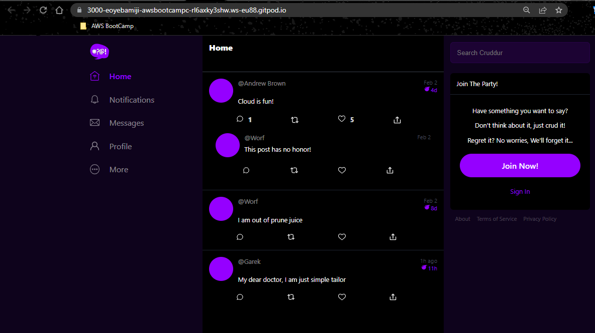
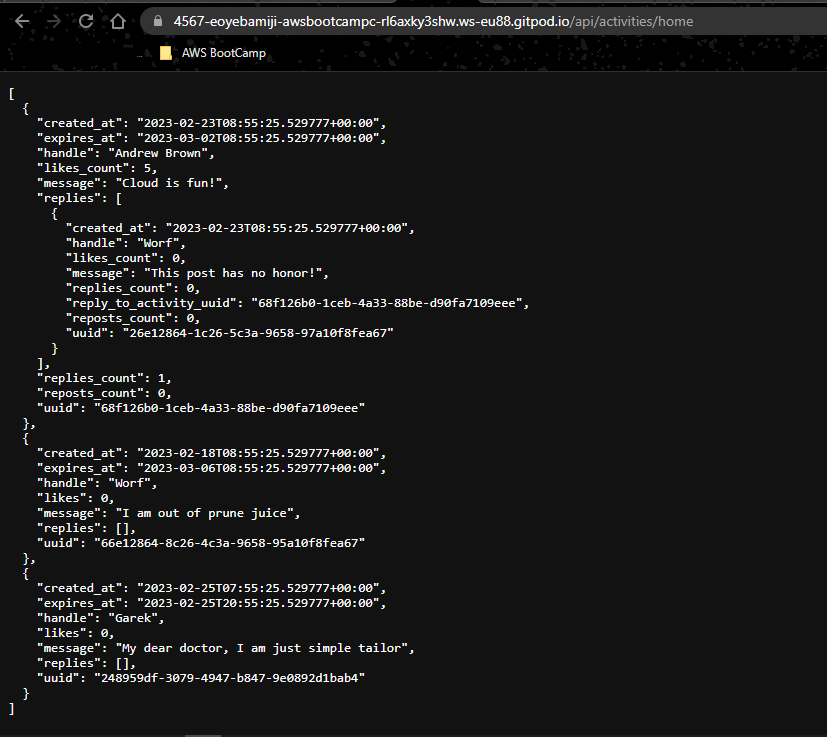

# Week 1 — App Containerization

## Journal Entry - Week 1: Application Containerization
Week 1 covered the next stage of our bootcamp process, which was [containerization](#containerization) of our application (Crudder) and testing all components of the application to ensure its readiness for deployment.

# Required Homework
[Containerize Backend and Frontend Application](#containerize-backend-and-frontend)
  In containerizing our application, we needed to use a package manager called "NPM" to install a.... we did the following for our application:

  Frontend:
  ```sh
   cd frontend-react-js        #Chnage directory to the frontend folder
   npm i                       #Npm installs the dependencies of the project
  ```
After using the above code, we confirmed that our backend application was in good shape.
+ Ports were open and made public


+ The front accessible over the web


Backend:
  ```sh
  cd backend-flask          #Chage directory to our backend folder
  export FRONTEND_URL="*"   #Exported the frontend url as an enviromental variable
  export BACKEND_URL="*"    #Exported the frontend url as an enviromental variable
  python3 -m flask run --host=0.0.0.0 --port=4567  #Run our backend application to allow access from any url only through specific ports
  cd ..
```
After using the above code, we confirmed that our backend application was in good shape.
+ Ports were open and made public


+ The backend accessible over the web ``` /api/activities/home ```



We then proceed to automate the processing of builidng our application by using a [Dockerfile](#dockerfile) to automate the containerization of our application.

Backend:

```sh
cd backend-flask
touch Dockerfile
cd backend-flask/Dockerfile
```
We then added our code into our created Dockerfile

```Dockerfile

FROM python:3.10-slim-buster

WORKDIR /backend-flask

COPY requirements.txt requirements.txt
RUN pip3 install -r requirements.txt

COPY . .

ENV FLASK_ENV=development

EXPOSE ${PORT}
CMD [ "python3", "-m" , "flask", "run", "--host=0.0.0.0", "--port=4567"]

```
Frontend:

```sh
cd frontend-react-js
touch Dockerfile
cd frontend-react-js/Dockerfile
```
We then added our code into our created Dockerfile

```Dockerfile
FROM node:16.18

ENV PORT=3000

COPY . /frontend-react-js
WORKDIR /frontend-react-js
RUN npm install
EXPOSE ${PORT}
CMD ["npm", "start"]

```


After creating our Dockerfile 

  - [Updating the OpenAPI definitions](#updating-the-openapi-definitions)
  - [Updating the backend and frontend code to add notifications functionality](#updating-the-backend-and-frontend-code-to-add-notifications-functionality)
  - [DynamoDB Local and PostgreSQL](#dynamodb-local-and-postgresql)
  


## Definition of terms
### Containerization
Containerization is a way of packaging software applications and their dependencies into a standalone, portable unit called a container. Containers provide a consistent and isolated environment for applications to run in, regardless of the underlying infrastructure. This means that applications can be easily moved between different environments, such as from a developer's laptop to a test environment or a production server, without the need for additional configuration or setup.
### Docker
Docker is a popular tool for creating and managing containers. It provides an easy-to-use interface for building, deploying, and running applications in containers. With Docker, you can package your application and its dependencies into a container, which can then be deployed to any environment that supports Docker. This makes it easier to move your application between different environments, such as development, testing, and production. Docker also provides a way to share and distribute container images, allowing others to quickly and easily run your application in their own environment. Overall, Docker simplifies the process of building, deploying, and managing applications, making it a popular tool for developers and DevOps teams.

### Dockerfile
A Dockerfile is a text file that contains instructions for building a Docker image. An image is a packaged, standalone executable software package that includes everything needed to run an application, including the application code, libraries, and other dependencies.
The Dockerfile provides a set of instructions for the Docker engine to create an image. It contains information such as what base image to use, what software packages to install, what files to copy into the image, and what commands to run. The Dockerfile can also set environment variables and define other configuration options.
Once the Dockerfile is created, it can be used to build an image using the Docker build command. The resulting image can then be used to create and run containers that contain the application. Overall, a Dockerfile is a way to automate the creation of Docker images, making it easier to manage and deploy applications in containers.
# Homework Challenges
+ [Run the Dockerfile CMD as an external script](#run-the-dockerfile-cmd-as-an-external-script)
+ [Pushing and tagging image to Docker Hub](#pushing-and-tagging-image-to-docker-hub)
+ [Multi-stage Build](#multi-stage-build)
+ [Implementing the healthcheck in docker-compose](#implementing-the-healthcheck-in-docker-compose)