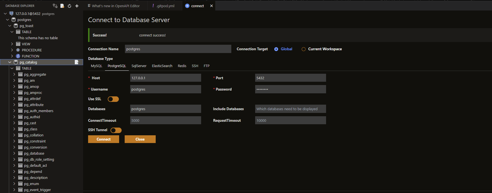
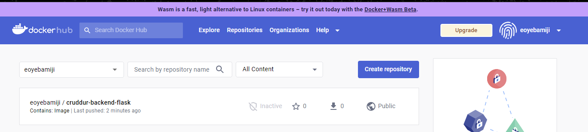

# Week 1 — App Containerization

## Journal Entry - Week 1: Application Containerization
Week 1 covered the next stage of our bootcamp process, which was [containerization](#containerization) of our application (Crudder) and testing all components of the application to ensure its readiness for deployment.

# Required Homework
## Containerize Backend and Frontend Application
  In containerizing our application, we needed to use a [package manager](#package-manager) called "NPM" to automate the installation and management of our software packages. we did the following for our application:

  Frontend:
  ```sh
   cd frontend-react-js        #Chnage directory to the frontend folder
   npm i                       #Npm installs the dependencies of the project
  ```
After using the above code, we confirmed that our backend application was in good shape.
+ Ports were open and made public


+ The front accessible over the web


Backend:
  ```sh
  cd backend-flask          #Chage directory to our backend folder
  export FRONTEND_URL="*"   #Exported the frontend url as an enviromental variable
  export BACKEND_URL="*"    #Exported the frontend url as an enviromental variable
  python3 -m flask run --host=0.0.0.0 --port=4567  #Run our backend application to allow access from any url only through specific ports
  cd ..
```
After using the above code, we confirmed that our backend application was in good shape.
+ Ports were open and made public


+ The backend accessible over the web ``` /api/activities/home ```


We then proceed to automate the processing of builidng our application by using a [Dockerfile](#dockerfile) to automate the containerization of our application.

Backend:

```sh
cd backend-flask
touch Dockerfile
cd backend-flask/Dockerfile
```
We then added our code into our created Dockerfile

```Dockerfile

FROM python:3.10-slim-buster

WORKDIR /backend-flask

COPY requirements.txt requirements.txt
RUN pip3 install -r requirements.txt

COPY . .

ENV FLASK_ENV=development

EXPOSE ${PORT}
CMD [ "python3", "-m" , "flask", "run", "--host=0.0.0.0", "--port=4567"]

```
Frontend:

```sh
cd frontend-react-js
touch Dockerfile
cd frontend-react-js/Dockerfile
```
We then added our code into our created Dockerfile

```Dockerfile
FROM node:16.18

ENV PORT=3000

COPY . /frontend-react-js
WORKDIR /frontend-react-js
RUN npm install
EXPOSE ${PORT}
CMD ["npm", "start"]

```

After creating our Dockerfile, we proceeded to building our container using the Dockerfile we created.

```
docker build -t frontend-react-js ./frontend-react-js       # Building the frontend container
docker build -t backend-flask ./backend-flask               # Building the backend conatiner
```
After building our container, we run the container

```
docker run -p 3000:3000 -d frontend-react-js                # Running the frontend container in background mode with specific port for access
docker run -p 4567:4567 -d backend-flask                  # Running the backendend container in background mode with specific port for access
```
We can confirm that our container is running and frontend image built

```
docker ps
docker images
docker ps -a
```

Next step was to create a [Docker-Compose](#docker-compose) file to handle mutiple containers as this will help us automate the need to build the frontend and backend simulteaneously rather than the manual method we used earlier through Dockerfile

At the root directory of our repository/project, we created a docker compose file

```sh
cd aws-bootcamp-crudder-2023
touch docker-compose.yml
```

We then added the following YAML code into our created docker-compose file

```YAML
version: "3.8"
services:
  backend-flask:
    environment:
      FRONTEND_URL: "https://3000-${GITPOD_WORKSPACE_ID}.${GITPOD_WORKSPACE_CLUSTER_HOST}"
      BACKEND_URL: "https://4567-${GITPOD_WORKSPACE_ID}.${GITPOD_WORKSPACE_CLUSTER_HOST}"
    build: ./backend-flask
    ports:
      - "4567:4567"
    volumes:
      - ./backend-flask:/backend-flask
  frontend-react-js:
    environment:
      REACT_APP_BACKEND_URL: "https://4567-${GITPOD_WORKSPACE_ID}.${GITPOD_WORKSPACE_CLUSTER_HOST}"
    build: ./frontend-react-js
    ports:
      - "3000:3000"
    volumes:
      - ./frontend-react-js:/frontend-react-js

# the name flag is a hack to change the default prepend folder
# name when outputting the image names
networks: 
  internal-network:
    driver: bridge
    name: cruddur
```
The above YAML script now allow us automate the builiding and running of our frontend and backend container

```
docker-compose up
```
After ```docker compose up``` command was executed, we can confirm that our frontend and backend applications are both running on their respective ports 3000 and 4567.


## Updating the OpenAPI definitions

We added definitions for Notifications in our OpenAI document.


## Updating the backend and frontend code to add notifications functionality
Backend:

We created a [Notifications](https://github.com/EOyebamiji/aws-bootcamp-cruddur-2023/blob/bc982e45d03617f0056cecfcb2362084061ac787/backend-flask/services/notifications_activities.py) file in our backend to handle our backend activities.


Frontend:

We created a [Notifications Feed Page](https://github.com/EOyebamiji/aws-bootcamp-cruddur-2023/blob/857889b2f3692f839be106c7832c58ef48d5d60d/frontend-react-js/src/pages/NotificationsFeedPage.js) file in our frontend to provide a UI for our notifications page.


## DynamoDB Local and PostgreSQL

We added a dynamodb database and postgres to reference our containers and 

DynamoDB
  ```YAML
  dynamodb-local:
    # https://stackoverflow.com/questions/67533058/persist-local-dynamodb-data-in-volumes-lack-permission-unable-to-open-databa
    # We needed to add user:root to get this working.
    user: root
    command: "-jar DynamoDBLocal.jar -sharedDb -dbPath ./data"
    image: "amazon/dynamodb-local:latest"
    container_name: dynamodb-local
    ports:
      - "8000:8000"
    volumes:
      - "./docker/dynamodb:/home/dynamodblocal/data"
    working_dir: /home/dynamodblocal
  ```
  
  Postgres
  ```YAML
    db:
    image: postgres:13-alpine
    restart: always
    environment:
      - POSTGRES_USER=postgres
      - POSTGRES_PASSWORD=password
    ports:
      - '5432:5432'
    volumes: 
      - db:/var/lib/postgresql/data

  ```
I tested connection to the postgres database created and added the posgres installation to [gitpod](https://github.com/EOyebamiji/aws-bootcamp-cruddur-2023/blob/347bb23c91a537bba11a8228321e291a2e52c46a/.gitpod.yml)





# Challenges Faced

After adding the dynamodb and postgres feature to our codebase, I realised i had a broken UI as the Navigation tags in my UI were missing. I modified the [Desktop Navigation](https://github.com/EOyebamiji/aws-bootcamp-cruddur-2023/blob/347bb23c91a537bba11a8228321e291a2e52c46a/frontend-react-js/src/components/DesktopNavigation.js) file to resolve this

# Homework Challenges
## Run the Dockerfile CMD as an external script
 
 - I created a [flask](https://github.com/EOyebamiji/aws-bootcamp-cruddur-2023/blob/main/backend-flask/flask.sh) script with the content in the backend directory

 ```
#!/bin/bash
python3 -m flash run --host=0.0.0.0 --port=4567
 ```
 - I Modified the Dockerfile to accomodate my new changes

```Dockerfile
FROM python:3.10-slim-buster

WORKDIR /backend-flask

COPY requirements.txt requirements.txt

RUN pip3 install -r requirements.txt

COPY . .

COPY flask.sh /usr/local/bin
RUN chmod +x /usr/local/bin/flask.sh

ENV FLASK_ENV=development

EXPOSE ${PORT}

CMD ["/usr/local/bin/flask.sh"]
```


 - I built the container
```
docker build -t backend-flask ./backend-flask
```


 - I ran the container with specifying the required enviromental variables and port to be opened

```
docker run -d --rm -p 4567:4567 -it -e FRONTEND_URL='*' -e BACKEND_URL='*' backend-flask
```


## Pushing and tagging image to Docker Hub

 - I logged into my DockerHub account via the CLI and Docker Extensionn

```
docker login
```


 - I tagged the image
```
docker tag SOURCE_IMAGE[:TAG] TARGET_IMAGE[:TAG]
docker tag backend-flask eoyebamiji/cruddur-backend-flask:1.0
```

 - I pushed the tagged image to Dockerhub and verified that that the image now resides on my dockerhub

```
docker push eoyebamiji/cruddur-backend-flask:1.0
```




 - I deleted my dockerhub credentials from the cli as it was saved in plain text in ``` ~/.docker/config.json ```

 ```
docker logout
 ```

 

## Implementing the healthcheck in docker-compose

I implemented a health check in my docker-compose to check the health of my docker images and containers when running

```YAML
    healthcheck:
      test: curl --fail https://4567-${GITPOD_WORKSPACE_ID}.${GITPOD_WORKSPACE_CLUSTER_HOST}/api/activities/home
      interval: 30s
      timeout: 10s
      retries: 3
```


## Best practise to follow when writing a Dockerfile

  + Use a small base image: Choose a small base image such as Alpine Linux. This will help reduce the size of our final image and improve its efficiency.
We adhered to this practise as we specified our base line image
```Dockerfile
FROM python:3.10-slim-buster
```

  + Only install necessary packages: Only install the packages and dependencies that are necessary for our application to run. This will help reduce the size of the final image and minimize the risk of security vulnerabilities.
We adhered to this practise as we specified our equirements in the requirements.txt file which we refrenced in our Dockerfile
```Dockerfile
COPY requirements.txt requirements.txt
RUN pip3 install -r requirements.txt
```

  + Use specific versions of packages: Use specific versions of packages instead of the latest version. This will help ensure that your application works as expected and reduces the risk of compatibility issues.
Our dockerfile didn't adhered to this principle as we didn't the version for our npm (our frontend dockerfile)
```Dockerfile
RUN npm install
```

  + Use a non-root user: Use a non-root user in your Dockerfile to run your application. This helps to improve security and reduce the risk of potential attacks.
We didn't specify a user in our Dockerfile which means the root user is  being utilised for our 

  + Use multi-stage builds: Use multi-stage builds to reduce the size of the final image. This involves using multiple Dockerfiles, with each one building on the previous one and discarding unnecessary files along the way.
Our Dockerfile did not use multi-stage builds, which may result in a larger final image size.

  + Use environment variables: Use environment variables in your Dockerfile to make it easier to configure your application. This will help simplify the deployment process and make it easier to manage.
Our Dockerfile uses an environment variable to set the Flask environment, which is follows best practices.

  + Use a .dockerignore file: Use a .dockerignore file to exclude unnecessary files and directories from being included in the final image. This will help reduce the size of the final image and improve its efficiency.
We used a .gitignore file to specifiy exclusions

  + Keep your Dockerfile simple: Keep your Dockerfile simple and easy to understand. This will help make it easier for others to use and maintain your Dockerfile.


## Definition of terms
### Containerization
Containerization is a way of packaging software applications and their dependencies into a standalone, portable unit called a container. Containers provide a consistent and isolated environment for applications to run in, regardless of the underlying infrastructure. This means that applications can be easily moved between different environments, such as from a developer's laptop to a test environment or a production server, without the need for additional configuration or setup.

### Container
Container is a standard unit of software that packages application codes and its dependencies into a single object. It is a layer of images with a linux baseline.

### Package Manager
A package manager is a tool that automates the process of installing, upgrading, configuring, and removing software packages. It manages the dependencies between packages, ensuring that all required software is installed and configured correctly. Package managers are used to simplify the installation and management of software on a system.
### Docker
Docker is a PAAS product that uses OS-level virtualization to deliver software in packages called [containers](#container). It is a software platform that simplifies the process of building, running, managing and distributing applications.

### Dockerfile
A Dockerfile is a text file that contains instructions for building a Docker image. An image is a packaged, standalone executable software package that includes everything needed to run an application, including the application code, libraries, and other dependencies.
The Dockerfile provides a set of instructions for the Docker engine to create an image. It contains information such as what base image to use, what software packages to install, what files to copy into the image, and what commands to run. The Dockerfile can also set environment variables and define other configuration options.
Once the Dockerfile is created, it can be used to build an image using the Docker build command. The resulting image can then be used to create and run containers that contain the application. Overall, a Dockerfile is a way to automate the creation of Docker images, making it easier to manage and deploy applications in containers.

### Docker Compose
Docker Compose is a tool that allows you to define and run multi-container Docker applications. It is used to simplify the management of multiple Docker containers by allowing you to define them all in a single configuration file.
With Docker Compose, you can define the containers, their dependencies, and their configuration all in one YAML file. You can then start and stop the containers using simple commands, and Docker Compose will handle the orchestration of the containers, including their network connections and volume sharing.
Docker Compose is particularly useful for developing and testing multi-container applications, as it allows you to easily spin up a complete development environment with all the necessary containers.