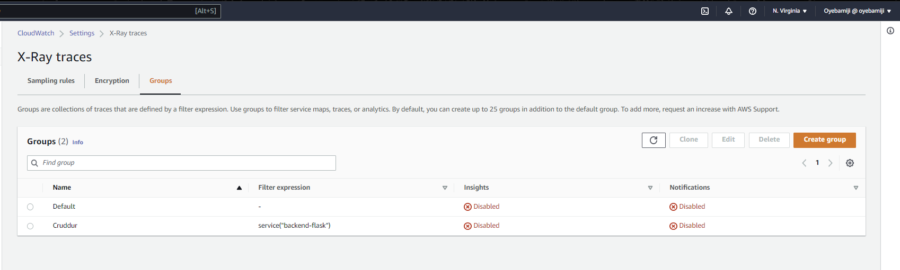
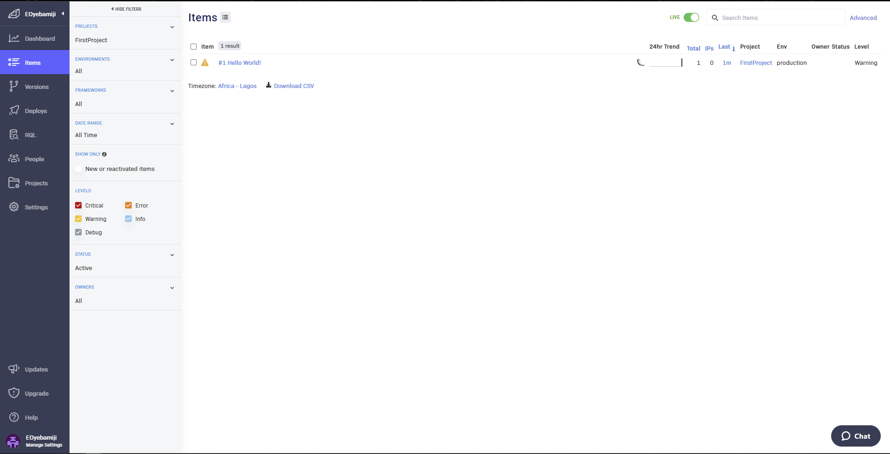

# Week 2 — Distributed Tracing

## Journal Entry - Week 2: Distributed Tracing and Observability
Week 2 covered the next stage of our bootcamp process, which was adding components of observability and tracing into our application (Crudder) and testing all components of the application to ensure its readiness for deployment.
We carried out the below highlighted activities

### Honeycomb

- Instrument our backend flask application to use Open Telemetry [OTEL](#otel) with Honeycomb.io as the provider
we added new dependencies into our application for creating new datasets and query to be captured by Honeycomb into our application.
- Run queries to explore traces within Honeycomb.io
    + I completed all the task as shown in the livestream
    + I confirmed trace data is captured in Honeycomb.io

        

# X-Ray

+ Instrument AWS X-Ray into backend flask application
    + I completed all the task as shown in the livestream

        
        
        

    + I Configured and provisioned X-Ray daemon within docker-compose and send data back to X-Ray API
    ```yaml
    AWS_XRAY_URL: "*4567-${GITPOD_WORKSPACE_ID}.${GITPOD_WORKSPACE_CLUSTER_HOST}*"
    AWS_XRAY_DAEMON_ADDRESS: "xray-daemon:2000"
      xray-daemon:
    image: "amazon/aws-xray-daemon"
    environment:
      AWS_ACCESS_KEY_ID: "${AWS_ACCESS_KEY_ID}"
      AWS_SECRET_ACCESS_KEY: "${AWS_SECRET_ACCESS_KEY}"
      AWS_REGION: "us-east-1"
    command:
      - "xray -o -b xray-daemon:2000"
    ports:
      - 2000:2000/udp
    ```

+ Observed X-Ray traces within the AWS Console

    
    

## Rollbar
+ Integrated Rollbar for Error Logging

    
    

    + I Triggered an error an observe an error with Rollbar

        

## CloudWatch
+ I completed all the steps provided to implement Cloudwatch logging in AWS
+ Used WatchTower as a log handler in AWS CloudWatch
+ Used Logging to manage logs generated
+ Confirmed Logs stream are captured in AWS CloudWatch

    


## OTEL:
OpenTelemetry is a set of open source libraries and tools used for collecting, processing, and exporting telemetry data (such as metrics, traces, and logs) from distributed systems and applications. It provides a standard way to instrument code, collect and export telemetry data in a vendor-neutral format, and supports multiple languages and platforms.