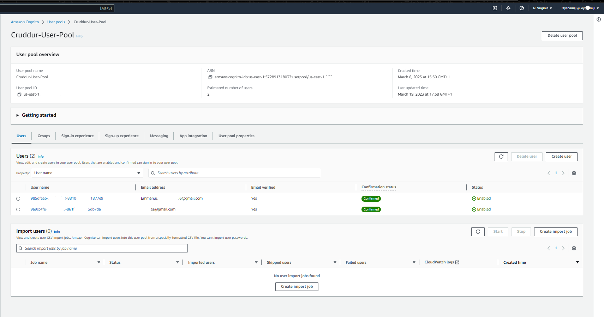

# Week 3 — Decentralized Authentication


## Amazon Cognito User Pool
On the AWS console for Cognito, I created a new user pool with the following configurations:

+ Configure sign-in experience with email selected only;
+ Configure security requirements with no MFA;
+ Configure sign-up experience with name and preferred_username as additional required attributes;
+ Configure message delivery by email instead of SES;
+ Integrate app with user pool name cruddur-user-pool and app client name cruddur.

The Cognito user pools stores the credentails of users logged into our application and generates a unique user ID for each user to authenticate the login into the applcation.

I Installed and configured AWS Amplify for client-side library for Cognito while I used AWS JWT server side verify to authenticate API endpoints in our Flask Application.

+ Install Amplify by running command ```npm i aws-amplify --save``` in the frontend-react-js path. This will update the package.json and package-lock.json accordingly with the Amplify package.
+ Implement API calls to Amazon Coginto for custom login, signup, recovery and forgot password page. This handles authentication (Amplify) instead of cookies earlier utilised.

+ In the backend directory ```backend-flask```, implement the below endpoints in ```app.py```

I configured ```cognito_jwt_token``` and ```cors```, changed ```data_home():``` set ```data = HomeActivities.run(cognito_user_id=claims['username'])``` when authenticated, and ```data = HomeActivities.run()``` when unauthenticated. Consequently, in ```/services/home_activities.py```, changed ```class HomeActivities``` by adding an extra_crud when is not equal to none```cognito_user_id != None```.

Added the enviromental variables for Cognito user pool in docker compose file ```docker-compose.yml```

Created Cognito user pool 

